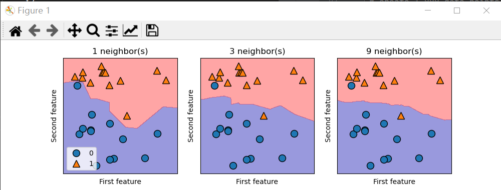
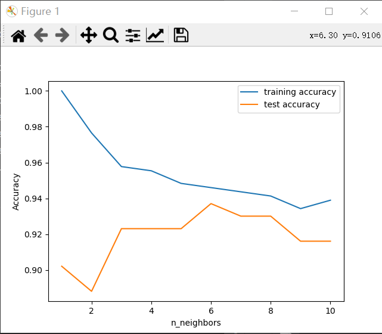
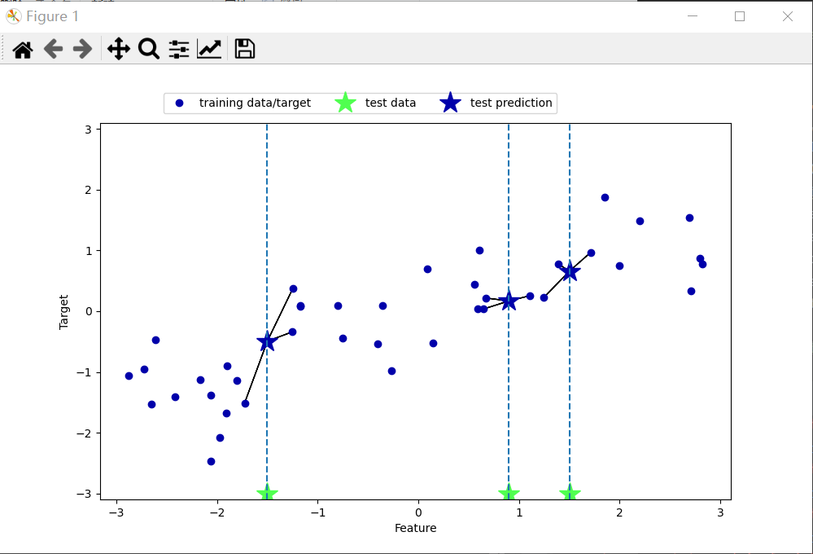
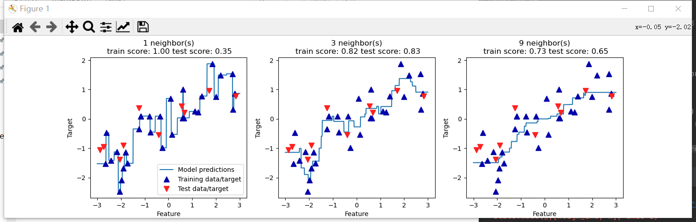

推荐书目《Introduction of Machine Learning with Python》    
这本书有代码，而且讲解的相对比较详细，虽然本人其实还没怎么学过matplotlib，但是按图索骥还是可以的

# K临近
## 1，分类
这个原理比较简单，就是在training data的基础上，让test data和training data比较，选出最靠近该test data的K个数据，按照少数服从多数的原则来确定其属于哪一个类别。    

解释一下，下面这个是根据参考书目的代码的，
这个选的是forge数据集。需要用到sklearn,matplotlib,numpy,mglearn   
首先下载数据到X,y上面，用train_test_split方法来随机分数据，将数据分成75%training set和25%的test set。    
然后import KNeighborClassifier（应该是指K临近分类器），用training set去训练一下，也就是fit；然后.score(X_test,y_test)可以return出该模型在使用test set评估得到的准确度（约0.83）    
然后是可视化 import matplotlib.pyplot as plt ，然后按照下面的做就是了（虽然其实是因为我不懂matplotlib T_T），这里面会可视化当k=1,3,9时的准确度和决策边界。
    
    import mglearn.datasets

    from sklearn.model_selection import train_test_split
    X,y=mglearn.datasets.make_forge()
    X_train,X_test,y_train,y_test=train_test_split(X,y,random_state=0)

    from sklearn.neighbors import KNeighborsClassifier
    clf=KNeighborsClassifier(n_neighbors=1)
    clf.fit(X_train,y_train)
    print("Test set accuracy: {:.2f}".format(clf.score(X_test,y_test)))
    #The following code produces the visualization of the
    #decision boundaries for one, three, and nine neighbors.
    import matplotlib.pyplot as plt
    fig,axes=plt.subplots(1,3,figsize=(10,3))
    for n_neighbors,ax in zip([1,3,9],axes):
        #the fit method returns the obj self, so we can instantiate
        #and fit in one line
        clf=KNeighborsClassifier(n_neighbors=n_neighbors).fit(X,y)
        mglearn.plots.plot_2d_separator(clf,X,fill=True,eps=0.5,ax=ax,alpha=.4)
        mglearn.discrete_scatter(X[:,0],X[:,1],y,ax=ax)
        ax.set_title("{} neighbor(s)".format(n_neighbors))
        ax.set_xlabel("First feature")
        ax.set_ylabel("Second feature")
    axes[0].legend(loc=3)
    plt.show()
    
后面的懒得再这样说了，简单在md文件讲一下：   
1，第二块代码是cancer数据的模型对比折线图，自变量是k，因变量是training set和test set的相对于该模型的准确率    

2，第三块代码是K=3时候的K临近回归    

3，第四块代码是在不同的K下，K临近回归的效果   
    
代码我都会上传到GitHub上面的。

## 2，回归
其实回归和分类类似，不过要求的是值。因此回归问题是针对测试集的因变量和哪k个训练集的数据在因变量上离得最近，然后就取平均值就好了，在上面的3,4图中应该也可以看出来。

## 3，优缺点
K临近优点在于直观，经常可以给出相对还是比较合理的预测；缺点在于不适用于大量数据（生成KNN模型比较慢）、对于feature比较多的数据不适用、以及对于feature=0的一类数据不适用（翻译自书本）    因此这玩意貌似在实际当中并不常用    
One of the strengths of k-NN is that the model is very easy to understand, and often
gives reasonable performance without a lot of adjustments. Using this algorithm is a
good baseline method to try before considering more advanced techniques. Building
the nearest neighbors model is usually very fast, but when your training set is very
large (either in number of features or in number of samples) prediction can be slow.
When using the k-NN algorithm, it’s important to preprocess your data (see Chap‐
ter 3). This approach often does not perform well on datasets with many features
(hundreds or more), and it does particularly badly with datasets where most features
are 0 most of the time (so-called sparse datasets).
So, while the nearest k-neighbors algorithm is easy to understand, it is not often used
in practice, due to prediction being slow and its inability to handle many features.
The method we discuss next has neither of these drawbacks.