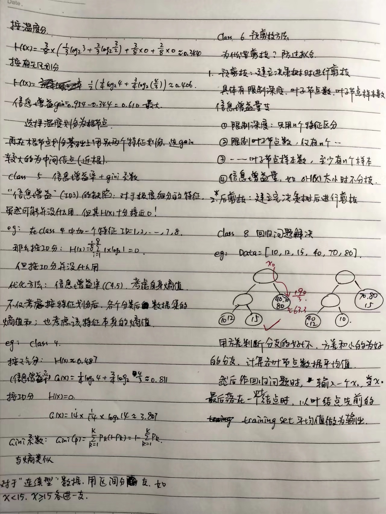

决策树部分分为分类和回归，分类部分在B站的视频中讲得比较详细；同时，由于提到“后剪枝”方法使用较少同时比较晦涩，本人笔记中不作介绍，事实上我也没咋听。     
代码部分参照视频，好像是要用到matplotlib：[https://www.bilibili.com/video/BV1xS4y1w7GJ?p=16&vd_source=4d06eb316f274542e023407934dfa2c7](https://www.bilibili.com/video/BV1xS4y1w7GJ?p=16&vd_source=4d06eb316f274542e023407934dfa2c7)

